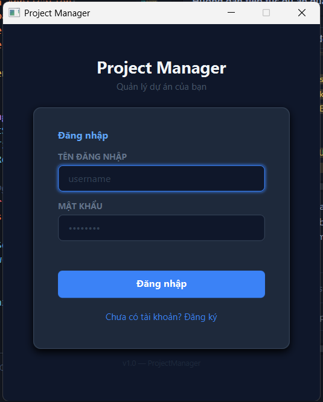
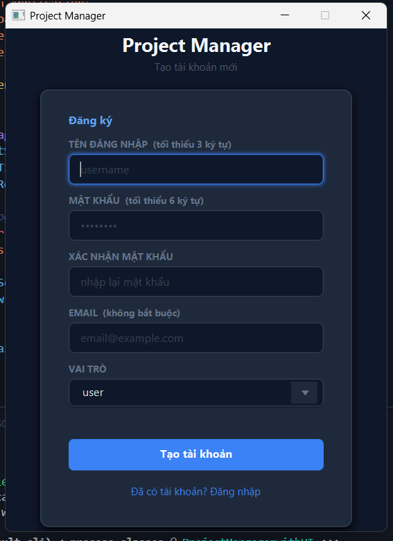
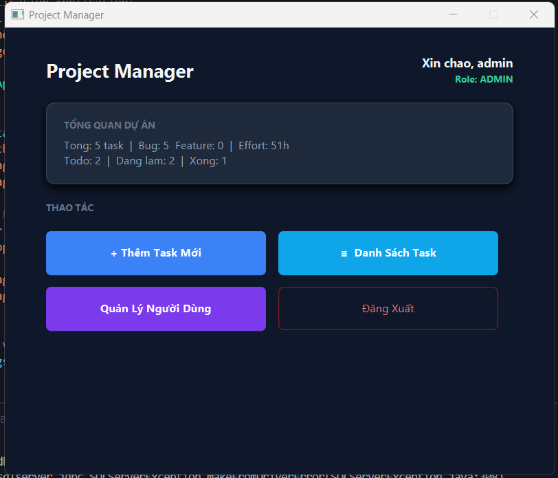
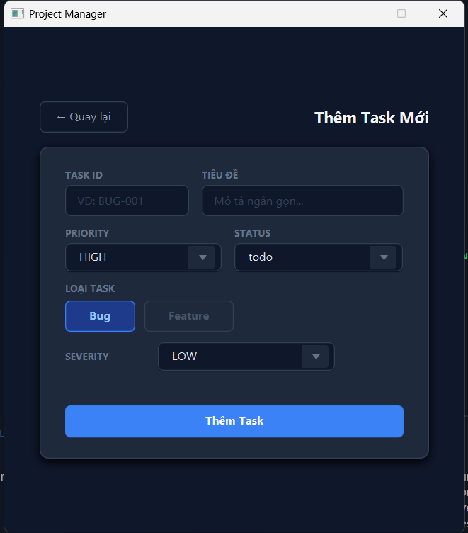
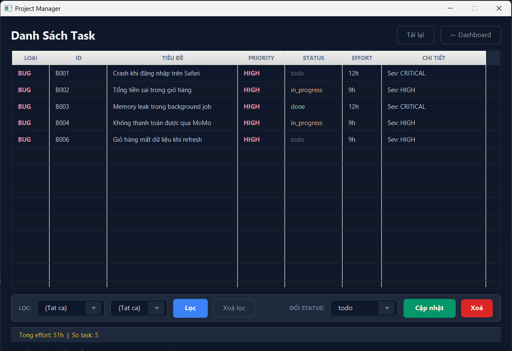
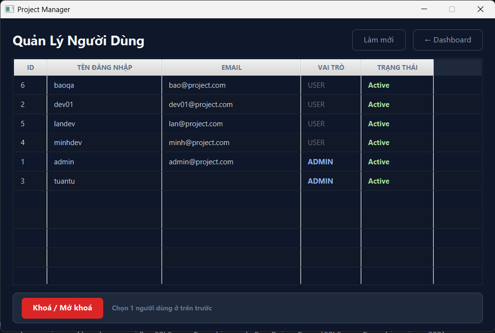

# ProjectManagerApp

A desktop **Bug & Feature tracking** application built with **Java 21 + JavaFX**, connected to **SQL Server** via JDBC.  
Supports User/Admin roles, login, registration, task creation, filtering, status updates, and real-time statistics.

> Learning project — applying OOP, Design Patterns, Generics, Exception Handling, Multithreading, and JDBC.

---

## Screenshots

| Login | Register |
|---|---|
|  |  |

| Dashboard (Admin) | Add Task |
|---|---|
|  |  |

| Task List | User Management |
|---|---|
|  |  |

---

## Tech Stack

| Component | Detail |
|---|---|
| Language | Java 21 |
| UI Framework | JavaFX 21.0.10 (FXML + CSS) |
| Build Tool | Maven + `javafx-maven-plugin` |
| Database | SQL Server — JDBC driver `mssql-jdbc 13.4.0.jre11` |
| Password | SHA-256 via `MessageDigest` + Base64 |

---

## Project Structure

```
src/main/java/com/projectmanager/
├── MainApp.java                        # JavaFX entry point
├── config/DatabaseConfig.java          # SQL Server connection (Singleton)
├── exceptions/AppException.java        # Custom unchecked exception
├── factory/TaskFactory.java            # Factory Pattern — creates Bug / Feature
├── models/
│   ├── Task.java                       # Abstract base class
│   ├── Bug.java                        # Extends Task + ISeverityRatable
│   ├── Feature.java                    # Extends Task + IAssignable
│   ├── ITask / IAssignable / ...       # Interfaces
│   ├── dto/LoginRequest.java
│   └── entity/User.java
├── repository/
│   ├── TaskRepository.java             # CRUD for Tasks table
│   └── UserRepository.java             # CRUD for Users table
├── service/
│   ├── ProjectService.java             # Singleton + Generic<T extends Task>
│   └── AuthService.java                # login / register
├── session/UserSession.java            # Holds logged-in user (static Singleton)
├── ui/
│   ├── SceneSwitcher.java              # FXML scene navigation helper
│   └── controllers/
│       ├── LoginController.java
│       ├── RegisterController.java
│       ├── DashboardController.java
│       ├── AddTaskController.java
│       ├── TaskListController.java
│       └── UserListController.java
└── utils/
    ├── PasswordHasher.java             # SHA-256 hash + verify
    └── Validator.java                  # Input validation helpers

src/main/resources/com/projectmanager/ui/
├── views/          # 6 FXML files (login, register, dashboard, add_task, task_list, user_list)
└── styles/main.css # Clean dark theme (Tailwind Slate palette)
```

---

## Design Patterns & Java Concepts

| Concept | Where applied |
|---|---|
| **Singleton** | `DatabaseConfig`, `ProjectService`, `UserSession` |
| **Factory** | `TaskFactory.create("B" / "F")` |
| **Template Method** | `Task.printSummary()` — Bug/Feature override details |
| **DAO / Repository** | `TaskRepository`, `UserRepository` |
| **Generics** | `ProjectService<T extends Task>` |
| **Concurrency** | `synchronized(lock)`, `loadFromDBAsync()`, `Platform.runLater()` |
| **Functional Java** | `Consumer<Integer>`, `Stream`, method references (`Task::GetEffort`) |
| **SHA-256** | `PasswordHasher` — one-way hash, verify by re-hashing |
| **Role-based Auth** | `UserSession.isAdmin()` — UI hide + handler guard |
| **Two Pointer** | `reverseOrder()` in-place O(1) space |
| **HashSet dedup** | `findDuplicateIds()` — LeetCode #217 pattern |

---

## Setup

### Requirements
- JDK 21
- Maven 3.9+
- SQL Server running at `localhost:1433`

### Database

Create the database and run the setup script from `BAI20/ProjectManagerApp_Guide_00_Setup.md`.

Default accounts after setup:

| Username | Password | Role |
|---|---|---|
| `admin` | `admin` | admin |
| `dev01` | `user123` | user |

### Configure connection

Edit [`DatabaseConfig.java`](src/main/java/com/projectmanager/config/DatabaseConfig.java):

```java
private static final String URL      = "jdbc:sqlserver://localhost:1433;databaseName=ProjectManagerDB;encrypt=false";
private static final String USER     = "sa";
private static final String PASSWORD = "your_password";
```

### Run

```bash
mvn clean javafx:run
```

---

## Progress

| Guide | Description | Status |
|---|---|---|
| 00 | Project setup (Maven + JavaFX + SQL Server) | ✅ |
| 01 | Core Models (Task, Bug, Feature, interfaces) | ✅ |
| 02 | Data Layer (Repository, DatabaseConfig, JDBC) | ✅ |
| 03 | Service Layer (TaskFactory, ProjectService, AuthService) | ✅ |
| 04 | Utils / Session / Exception (PasswordHasher, Validator, UserSession) | ✅ |
| 05 | Controllers (Login, Register, Dashboard, AddTask, TaskList, UserList) | ✅ |
| 06 | FXML + CSS (dark theme UI, scene switching) | ✅ |
